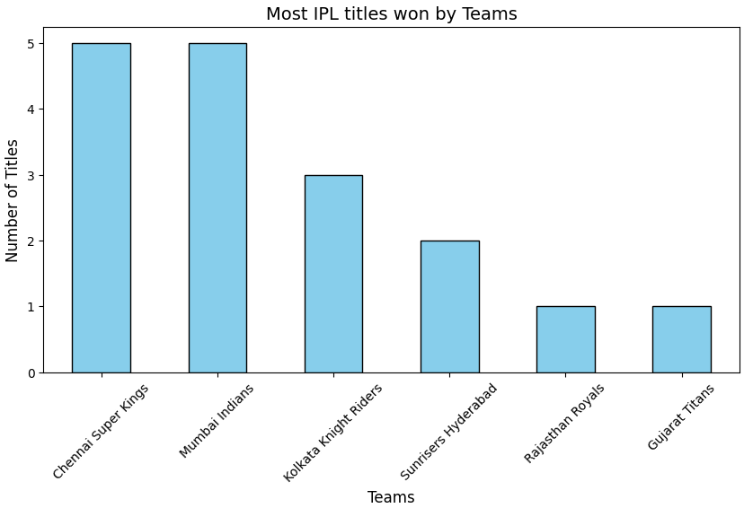
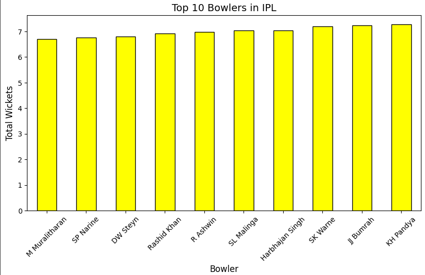
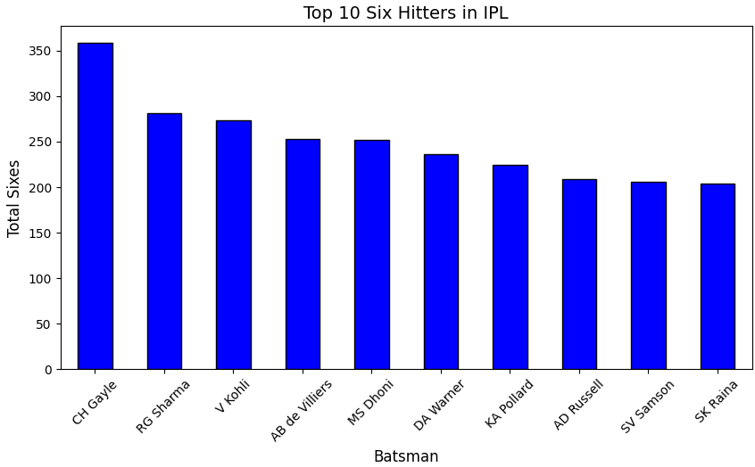
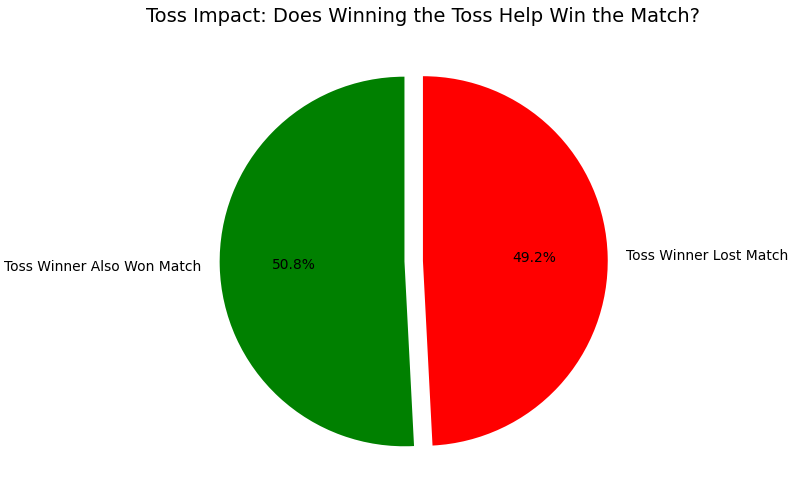
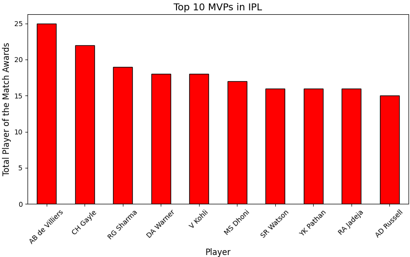

# 🏏 IPL Dataset Analysis - Storytelling with Data 📊

## 🚀 Overview  
Welcome to an **exciting deep dive** into IPL (Indian Premier League) analytics!  
This project transforms raw IPL data into **insightful, visually appealing, and storytelling-driven analysis.**  
Through data visualization and statistical exploration, we uncover trends that shape the league.  

## 📂 Dataset Details  
📌 **Source:** Kaggle (or specify the actual source)  
📊 **Content:** Match results, player statistics, toss impact, stadium effects, and more.  
📁 **Format:** CSV files processed with Python libraries (Pandas, Matplotlib, Seaborn)  

## 🎯 Analysis Goals  
✅ Identify **the most successful IPL teams and players** 🏆  
✅ Discover **the impact of toss decisions on match outcomes** 🎲  
✅ Find out **which stadiums give home teams an advantage** 🏟️  
✅ Determine **the player with the most sixes and the best economy rate** 🔥  

## 🛠️ Technologies Used  
🔹 **Programming Language:** Python 🐍  
🔹 **Libraries:** Pandas, Matplotlib, Seaborn, NumPy  
🔹 **Visualization Tools:** Matplotlib, Seaborn, PowerBI  

## 🚀 How to Use  
1️⃣ **Download the dataset** 📂 – Make sure to get the required dataset before running the project.  
2️⃣ **Run the Jupyter Notebook** 📒 – Open the `.ipynb` file in **Jupyter Notebook** or Google Colab.  
3️⃣ **Explore insights from visualizations** 📊 – Check the graphs and results to understand the patterns.  

🎯 _Now you’re ready to analyze and interpret the data!_ 🚀

## 🔥 Key Findings & Visualizations  

### 🏆 Most Successful IPL Teams  
  

### 🎯 Best Economy Rate (Bowlers)  
  

### 💥 Most Sixes by a Player  
  

### 🎲 Toss Impact on Winning  
  

### 🏅 Most Valuable Player (MVP)  
 

## 📢 Conclusion  
This project showcases the **power of data in cricket analytics.**  
From team dominance to player consistency, the insights extracted here can help **fans, analysts, and franchises** make better predictions and decisions.  

### 🔮 What’s Next?  
💡 Implement **machine learning models** to predict match outcomes!  
💡 Build **interactive dashboards** with Tableau or Power BI!  

## 👤 Author & Acknowledgments  
🚀 **Author:** Kirti Chaudhari  
📊 **Data Source:** Kaggle  
🛠️ **Tools Used:** Python, Pandas, Seaborn, Matplotlib  

📌 _If you found this analysis useful, **drop a ⭐ star** on this repository!_ 🚀  

